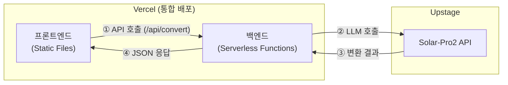

# 업무 말투 변환기 — PRD (제품 요구사항 명세서)

> **대상 독자**: 바이브 코딩(Vibe Coding) 입문 개발자
> **실습 형태**: One Day 프로젝트 (약 4시간)
> **문서 목적**: 오늘 하루 구현의 모든 기준과 명세를 담은 실행 문서
> **연관 문서**: 업무 말투 변환기 — 프로그램 개요서

---

## 목차

1. [완료 체크리스트](#1-완료-체크리스트)
2. [실습 원칙](#2-실습-원칙)
3. [기술 스택 및 사전 준비](#3-기술-스택-및-사전-준비)
4. [기능 요구사항](#4-기능-요구사항)
5. [시스템 아키텍처](#5-시스템-아키텍처)
6. [화면 디자인 및 스타일 가이드](#6-화면-디자인-및-스타일-가이드)
7. [디렉토리 구조](#7-디렉토리-구조)
8. [API 명세](#8-api-명세)
9. [단계별 구현 가이드](#9-단계별-구현-가이드)
10. [바이브 코딩 프롬프트 예시](#10-바이브-코딩-프롬프트-예시)
11. [배포 가이드](#11-배포-가이드)

---

## 1. 완료 체크리스트

> 📌 **규칙 1 적용**: "뭘 만들면 완료인지" 기준을 미리 정의합니다.
> 아래 항목을 모두 체크할 수 있으면 오늘 실습은 완성입니다.

### 백엔드
- [x] FastAPI 서버가 로컬에서 정상 실행된다 (`uvicorn main:app`)
- [x] `POST /api/convert` 엔드포인트가 존재한다
- [ ] Upstage Solar-Pro2 API 호출이 정상 작동한다
- [x] 수신 대상(상사 / 타팀 동료 / 고객 / 팀 내 동료)에 따라 다른 프롬프트가 적용된다
- [x] CORS 설정이 되어 있어 프론트엔드에서 호출 가능하다
- [x] 정적 파일(HTML, CSS, JS) 서빙 로직이 구현되어 있다 (루트 접속 시 index.html 반환)
- [x] `.env` 파일로 API 키를 관리하고, `.gitignore`에 등록되어 있다

### 프론트엔드
- [x] 텍스트 입력창이 있다
- [x] 수신 대상 선택 버튼이 있다 (4종)
- [x] [변환하기] 버튼 클릭 시 API를 호출한다
- [x] 처리 중 로딩 표시가 나타난다
- [x] 변환 결과가 화면에 출력된다
- [x] [복사하기] 버튼이 작동한다

### 배포
- [ ] GitHub 레포지토리에 코드가 올라가 있다
- [ ] Vercel에서 통합 배포(Front + Back)가 정상 작동한다
- [ ] 배포된 URL에서 실제 변환이 작동한다

---

## 2. 실습 원칙

> 바이브 코딩의 **속도**는 살리되, AI에 끌려다니지 않기 위한 4가지 원칙입니다.

---

### 원칙 1. 완료 기준을 먼저 정의하라

**"뭘 만들면 끝인지" 체크리스트를 미리 적어라**

AI도 사람도 "끝"의 기준이 명확해야 헤매지 않습니다.
기준 없이 시작하면 AI는 계속 기능을 추가하고, 하루가 지나도 완성되지 않습니다.

```
✅ 좋은 프롬프트: "오늘 목표는 체크리스트의 항목들만 구현하는 거야.
                  그 외 기능은 추가하지 마."

❌ 나쁜 프롬프트: "업무 말투 변환기 만들어줘."
```

---

### 원칙 2. 새 기술은 조사 먼저, 구현 나중

**5분의 조사가 1시간의 디버깅을 아껴준다**

새로운 라이브러리나 외부 API를 붙이기 전에는 먼저 물어보고 파악한 뒤 구현합니다.
특히 **외부 API 연동, 패키지 버전, 인증 방식**은 반드시 먼저 확인합니다.

```
✅ 좋은 순서:
  1단계: "Upstage Solar-Pro2를 LangChain으로 연동하는 방법을 먼저 알려줘.
          코드는 아직 짜지 말고."
  2단계: 방법 이해 후 → "이제 그 방법으로 구현해줘."

❌ 나쁜 순서:
  바로: "Upstage Solar-Pro2 연동 코드 짜줘."
  → 구버전 API, 잘못된 패키지로 1시간 디버깅 시작
```

---

### 원칙 3. 버그는 분석 먼저, 수정 나중

**"원인부터 알려줘"가 근본 해결로 이어진다**

에러 메시지를 그냥 복붙하면 AI가 임의로 코드를 수정하고,
고쳐지는 것 같다가 다른 에러가 생기는 악순환이 시작됩니다.

```
✅ 좋은 대응:
  "이 에러가 왜 발생하는지 원인을 먼저 설명해줘.
   수정은 원인 파악 후에 같이 진행하자."

❌ 나쁜 대응:
  [에러 메시지 복붙]
  → AI가 임의 수정 → 다른 에러 발생 → 코드가 누더기
```

---

### 원칙 4. 배포 전 내가 한 번은 읽어라

**AI가 만든 코드라도 전체 흐름을 한 번 훑어야 내 것이 된다**

오늘 만든 코드를 이해하지 못한 채로 끝내면, 다음 실습의 출발점이 사라집니다.
배포 전 5분만 투자해서 전체 흐름을 스스로 설명할 수 있는지 확인합니다.

```
✅ 배포 전 셀프 체크:
  - 프론트엔드 → 백엔드 → LLM의 흐름을 말로 설명할 수 있는가?
  - API 요청/응답의 구조를 이해하는가?
  - 오늘 만든 코드에서 내가 직접 수정할 수 있는 부분이 있는가?
```

> 이 네 번째 원칙은 카파시가 바이브 코딩의 다음 단계로 제시한
> **"에이전틱 엔지니어링 — AI가 짜도 개발자가 감독·이해한다"** 의 정신과 일치합니다.

---

## 3. 기술 스택 및 사전 준비

### 기술 스택

| 영역 | 기술 | 비고 |
|------|------|------|
| 프론트엔드 | HTML5 / CSS3 / JavaScript (ES6+) | 프레임워크 없음 |
| 백엔드 | Python 3.11+ / FastAPI / Uvicorn | Serverless Functions on Vercel |
| AI 연동 | LangChain / Upstage Solar-Pro2 | |
| 환경 변수 | python-dotenv | `.env` 파일 관리 |
| 버전 관리 | Git / GitHub | |
| 배포 | Vercel | 프론트엔드 + 백엔드 통합 배포 |

### 사전 준비 체크리스트

```bash
# 1. Python 버전 확인
python --version  # 3.11 이상

# 2. pip 패키지 설치
pip install fastapi uvicorn langchain python-dotenv
pip install langchain-upstage   # Upstage LangChain 패키지

# 3. Upstage API 키 발급
# https://console.upstage.ai 에서 발급 후 .env 파일에 저장

# 4. Git 설치 확인
git --version

# 5. Vercel CLI 설치 (선택)
npm install -g vercel
```

### `.env` 파일 구성

```bash
# .env
UPSTAGE_API_KEY=your_api_key_here
```

> ⚠️ `.env` 파일은 절대 GitHub에 올리지 않습니다. `.gitignore`에 반드시 추가하세요.

---

## 4. 기능 요구사항

### 필수 기능 (오늘 구현)

| ID | 기능 | 설명 |
|----|------|------|
| F-01 | 텍스트 입력 | 사용자가 변환할 원문을 자유롭게 입력 |
| F-02 | 수신 대상 선택 | 상사 / 타팀 동료 / 고객 / 팀 내 동료 중 선택 |
| F-03 | 말투 변환 처리 | FastAPI → LangChain → Solar-Pro2 호출 |
| F-04 | 결과 출력 | 변환된 텍스트를 화면에 표시 |
| F-05 | 로딩 표시 | API 호출 중 처리 중 상태 표시 |
| F-06 | 결과 복사 | 변환 결과를 클립보드에 복사 |

---

## 5. 시스템 아키텍처



### 수신 대상별 프롬프트 전략

| 대상 코드 | 대상 | 시스템 프롬프트 방향 |
|-----------|------|---------------------|
| `boss` | 상사 / 임원 | 격식 있는 경어체, 공손하고 간결하게 |
| `colleague` | 타팀 동료 | 정중하되 협조적인 업무 어조 |
| `client` | 고객 / 외부 | 친절하고 신뢰감을 주는 서비스 어조 |
| `team` | 팀 내 동료 | 간결하고 실무적인 어조 |

---

## 6. 화면 디자인 및 스타일 가이드

### 6.1 디자인 컨셉
- **Professional & Clean**: 신뢰감을 주는 블루/인디고 컬러 톤 사용
- **Simple UX**: 한 눈에 흐름이 보이는 단일 페이지 구성 (Single Page App 느낌)

### 6.2 주요 레이아웃 구성
1. **Header**: 서비스 로고 및 타이틀 ("업무 말투 변환기")
2. **Input Section**:
   - 원문 입력창 (Textarea): "원문을 입력하세요..." (Placeholder)
3. **Selection Section**:
   - 수신 대상 선택 (4개 버튼): 상사 / 타팀 동료 / 고객 / 팀 내 동료
4. **Action Section**:
   - [변환하기] 버튼: 눈에 띄는 강조 컬러 적용
5. **Output Section**:
   - 결과 출력창 (Read-only Textarea)
   - [복사하기] 버튼: 하단 배치
6. **Footer**: 카피라이트 및 관련 링크

### 6.3 스타일 상세 (CSS 가이드)
- **Primary Color**: `#2563eb` (Indigo-600) - 포인트 컬러
- **Secondary Color**: `#f8fafc` (Slate-50) - 배경색
- **Border**: `1px solid #e2e8f0`, `border-radius: 8px`
- **Typography**: Pretendard 또는 시스템 기본 폰트 (Sans-serif)

### 6.4 상태 UI (Interactive UX)
- **Button Hover**: 마우스 오버 시 색상 변화
- **Active State**: 선택된 수신 대상 버튼은 강조색 배경 + 흰색 글씨
- **Loading State**: 변환 중 버튼 비활성화 및 스피너(또는 "변환 중..." 텍스트) 표시

---

## 7. 디렉토리 구조

```
├── .venv/                      # 가상환경 폴더 (STEP 1 생성, git 제외)
├── .gitignore                  # Git 제외 목록 (.env, .venv, __pycache__ 등)
├── README.md                   # 프로젝트 개요 및 실행 방법
├── .env                        # Upstage API 키 (STEP 1 생성, git 제외)
├── .env.example                # 환경 변수 샘플 파일
├── vercel.json                 # Vercel 배포 설정 파일 (STEP 4)
│
├── backend/                    # 백엔드 서버 (FastAPI)
│   ├── main.py                 # FastAPI 앱 설정, CORS 및 라우터 통합
│   ├── requirements.txt        # 의존성 패키지 목록
│   ├── models/
│   │   └── schemas.py          # Pydantic 기반 데이터 검증 모델
│   ├── prompts/
│   │   └── templates.py        # 대상별 프롬프트 템플릿
│   ├── services/
│   │   └── tone_converter.py   # LangChain 연동 및 변환 로직
│   └── routers/
│       └── convert.py          # API 엔드포인트 정의
│
└── frontend/                   # 프론트엔드 (Static HTML/CSS/JS)
    ├── index.html              # 메인 UI 레이아웃
    ├── css/
    │   └── style.css           # UI 디자인 및 스타일링
    └── js/
        └── app.js              # 버튼 이벤트 및 API 연동 로직
```

---

## 8. API 명세

### `POST /api/convert`

#### 요청
...
(기존 내용 유지)
...

### `GET /`

- **설명**: 프론트엔드 정적 페이지(`index.html`)를 반환합니다.
- **응답**: `text/html` (index.html 파일)

### `GET /health`

```json
{ "status": "ok" }
```

---

## 9. 단계별 구현 가이드

### STEP 1. 환경 준비 (30분)
... (기존 내용 유지) ...

### STEP 2. 백엔드 구현 (90분)
... (기존 내용 유지) ...

### STEP 3. 프론트엔드 구현 (60분)
... (기존 내용 유지) ...

---

### STEP 4. 배포 (30분)

> 📌 **원칙 4 적용**: 배포 전 전체 흐름을 한 번 읽고 이해했는지 확인하세요.

**1. 코드 정리 및 GitHub 푸시**
   - 로컬에서 최종 테스트를 마치고, `.gitignore`가 정상 작동하여 `.env`나 가상환경 폴더가 포함되지 않았는지 확인합니다.
   ```bash
   git add .
   git commit -m "Final: Integrated deployment setup for Vercel"
   git push origin main
   ```

**2. Vercel 통합 배포 설정 (`vercel.json`)**
   - 프로젝트 루트에 `vercel.json` 파일을 생성하여 프론트엔드 정적 파일과 백엔드 API 라우팅을 설정합니다.
   - 백엔드는 Vercel의 Python Runtime을 사용하여 Serverless Function으로 동작하게 합니다.

**3. Vercel 프로젝트 생성 및 환경 변수 등록**
   - **Project 생성**: Vercel 대시보드에서 `Import Project`를 선택하고 레포지토리를 연결합니다.
   - **Environment Variables**: `UPSTAGE_API_KEY` 값을 Vercel 프로젝트 설정의 Environment Variables에 등록합니다.
   - **Build & Development Settings**: Root Directory를 프로젝트 최상단으로 설정합니다.

**4. 최종 확인**
   - **API URL 수정**: `frontend/js/app.js`의 `API_BASE` 상수를 `/api`와 같이 상대 경로로 수정합니다.
   - **배포 확인**: Vercel에서 부여한 도메인으로 접속하여 프론트엔드 UI가 잘 나오는지, 실제 변환 기능이 작동하는지 최종 확인합니다.

---

## 10. 바이브 코딩 프롬프트 예시
... (기존 내용 유지) ...

---

## 11. 배포 가이드

### `.gitignore` 필수 항목

```
# .gitignore
.env
__pycache__/
*.pyc
.DS_Store
.venv/
node_modules/
```

### `requirements.txt` (Root 및 backend/ 폴더 모두 관리 권장)

```
fastapi
uvicorn
langchain
langchain-upstage
python-dotenv
pydantic
```

### Vercel 통합 배포 설정 (`vercel.json`)

```json
{
  "rewrites": [
    {
      "source": "/api/(.*)",
      "destination": "/backend/main.py"
    },
    {
      "source": "/((?!api/).*)",
      "destination": "/frontend/$1"
    },
    {
      "source": "/",
      "destination": "/frontend/index.html"
    }
  ]
}
```

---

> 📌 **다음 단계**: 이 PRD를 완성한 뒤에는 각 기능을 확장하거나
> 로그인, 이력 저장 등 추가 기능을 붙여보세요.
> 오늘 만든 구조가 그 출발점이 됩니다.
